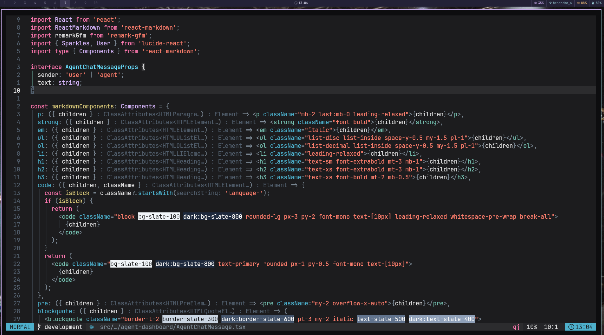
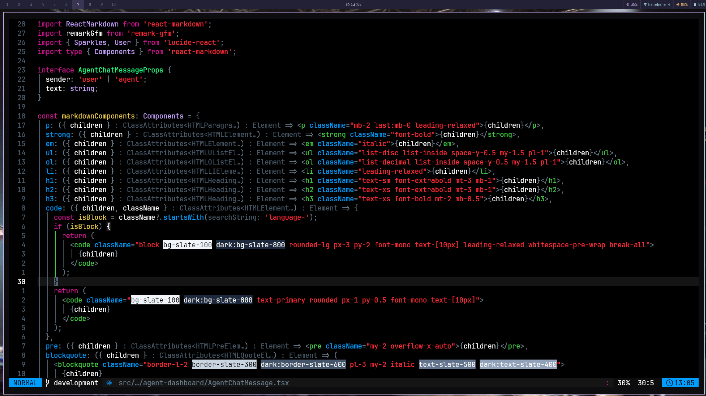
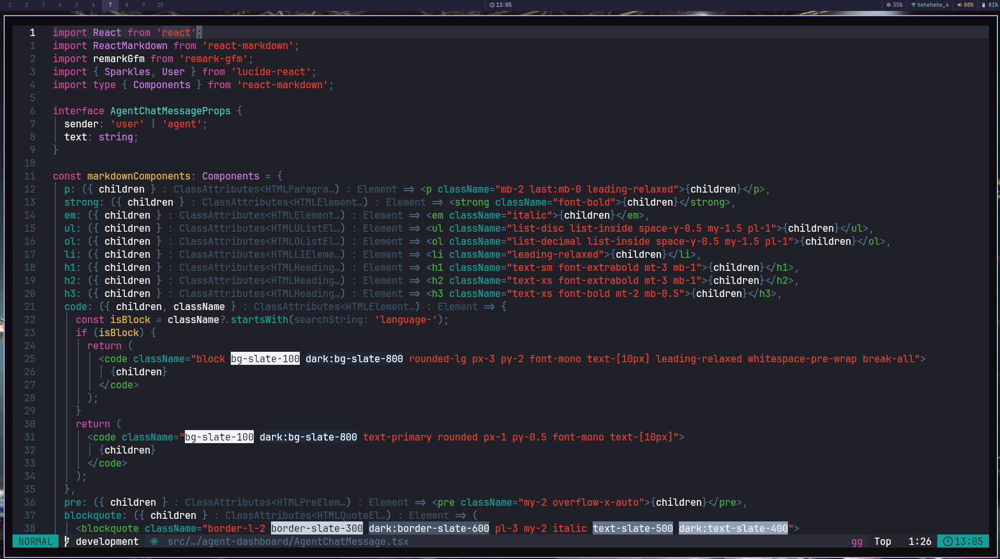
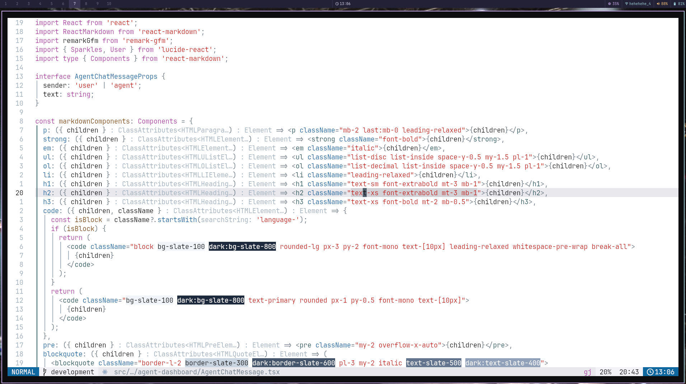

# xcodium.nvim

Xcode's color themes for Neovim. Five variants, full Tree-sitter and LSP support, transparent backgrounds.

## Screenshots






## Requirements

- Neovim >= 0.9
- True-color terminal

## Install

### lazy.nvim / LazyVim

```lua
{
  "arvindchoudhary33/xcodium.nvim",
  branch = "development",
  lazy = false,
  priority = 1000,
  config = function()
    require("xcodium").setup()
    vim.cmd.colorscheme("xcodium-dark")
  end,
}
```

> **LazyVim users:** add this to `lua/plugins/colorscheme.lua` and it will override your current theme.

### With options

```lua
{
  "arvindchoudhary33/xcodium.nvim",
  branch = "development",
  lazy = false,
  priority = 1000,
  config = function()
    require("xcodium").setup({
      style = "dark",       -- dark | light | midnight | dusk | wwdc16
      transparent = false,
      italic_comments = true,
    })
    vim.cmd.colorscheme("xcodium-dark")
  end,
}
```

## Variants

| Name                  | Command            |
| --------------------- | ------------------ |
| Dark                  | `xcodium-dark`     |
| Light                 | `xcodium-light`    |
| Midnight (pure black) | `xcodium-midnight` |
| Dusk                  | `xcodium-dusk`     |
| WWDC16                | `xcodium-wwdc16`   |

```vim
:colorscheme xcodium-midnight
```

## Palette

### Dark


### Midnight


### Dusk


### WWDC16


### Light


## Transparency

```lua
require("xcodium").setup({ transparent = true })
```

Toggle at runtime:

```lua
local cfg = require("xcodium.config")
require("xcodium").load(
  vim.tbl_extend("force", cfg.options, { transparent = not cfg.options.transparent })
)
```

## Customization

### Change colors

```lua
require("xcodium").setup({
  on_colors = function(c)
    c.blue = "#61afef"
    c.pink = "#e06c75"
  end,
})
```

### Change highlight groups

```lua
require("xcodium").setup({
  on_highlights = function(hl, c)
    hl.CursorLineNr = { fg = c.blue, bold = true }
    hl["@keyword"]  = { fg = c.pink, italic = true }
  end,
})
```

## lualine

```lua
require("lualine").setup({
  options = { theme = "xcodium" },
})
```

## Supported plugins

gitsigns · neo-tree · telescope · blink.cmp · indent-blankline · which-key · illuminate · snacks · bufferline · noice · flash · fzf-lua · lazy.nvim · git-conflict · lualine

Plugin groups are auto-loaded based on what you have installed. To load all of them regardless:

```lua
require("xcodium").setup({
  plugins = { all = true },
})
```

## Credits

- [lunacookies/vim-colors-xcode](https://github.com/lunacookies/vim-colors-xcode) — Dark and Light palette values
- [hdoria/xcode-themes](https://github.com/hdoria/xcode-themes) — Midnight and Dusk values
- [jstheoriginal/wwdc-2016-xcode-theme](https://github.com/jstheoriginal/wwdc-2016-xcode-theme) — WWDC16 palette
- [MateoCerquetella/xcode-theme](https://github.com/MateoCerquetella/xcode-theme) — cross-reference

## License

Free software. Do whatever you want with it.
